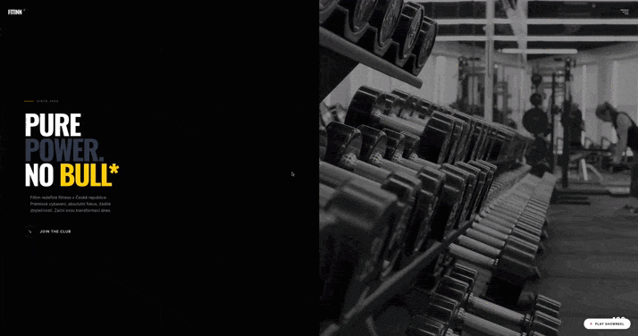
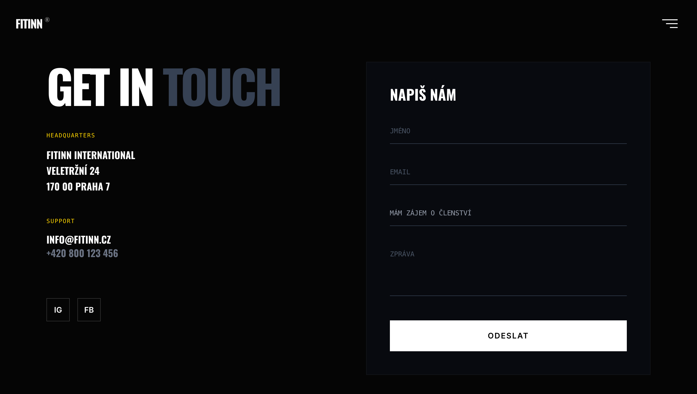

# FITINN REDESIGN (CONCEPT)

A high-performance UI/UX redesign concept for the FitInn fitness chain. The project reimagines the brand's digital presence through a "Dark Industrial" aesthetic, focusing on typographic hierarchy and micro-interactions.

**Built with the modern Astro 5 + React 19 stack for maximum speed and SEO.**

🔗 **[View Live Website](https://fitinn-redesign.vercel.app/)**

---

### / PREVIEW & DEMO



---

### / HIGH FIDELITY DESIGN

> **Homepage Concept.** Focus on typographic hierarchy and "Dark Industrial" aesthetic.
<br>


---

### / MOBILE FIRST EXPERIENCE

> **Responsive Adaptation.** Fully optimized navigation and touch interactions using Tailwind CSS grid.
<br>
<p align="center">
  
</p>

---

### / PAGE DETAILS & MODALS

<table style="border: none; width: 100%;">
  <tr>
    <td width="50%" valign="top">
      <h4 align="center">PRICING (CENÍK)</h4>
      
    </td>
    <td width="50%" valign="top">
      <h4 align="center">INTERACTIVE MODALS</h4>
      
    </td>
  </tr>
  <tr>
    <td colspan="2" align="center">
      <h4 align="center">CONTACT & STUDIOS MAP</h4>
      
    </td>
  </tr>
</table>

---

## / DESIGN DIRECTION

The visual identity moves away from corporate sterility to a bold, motivation-driven interface.

* **Aesthetic:** Dark Mode Industrial / Brutalist influence.
* **Palette:** Monochrome (Black/White) with high-voltage "Neon Yellow" accents.
* **Typography:**
    * **Headings:** *Oswald* — Condensed and bold for impact.
    * **Body:** *Inter* — Clean and readable for UI elements.
* **User Experience:** Priority on visual storytelling and frictionless navigation ("Join the Club" flow).

## / TECH STACK & FEATURES

This project utilizes a cutting-edge "Bleeding Edge" stack to ensure 100/100 Lighthouse performance scores.

| Technology | Role |
| :--- | :--- |
| **Astro 5** | Core framework for Static Site Generation (SSG) and performance. |
| **React 19** | Component architecture for interactive islands. |
| **Tailwind CSS 4** | Next-gen utility-first styling engine (Vite integration). |
| **Framer Motion** | Complex UI transitions and entrance animations. |
| **Lenis** | Premium smooth scrolling experience. |
| **Leaflet Maps** | Custom interactive map integration for club locations. |

## / KEY IMPLEMENTATIONS

1.  **Island Architecture:** Heavy JS (like Maps and Sliders) loads only when needed, keeping the initial load instant.
2.  **Smooth Scroll:** Integrated `lenis` for a luxurious, app-like scrolling feel.
3.  **Responsive Layout:** Mobile-first approach using Tailwind's grid system.

## / INSTALLATION

```bash
npm install
npm run dev
